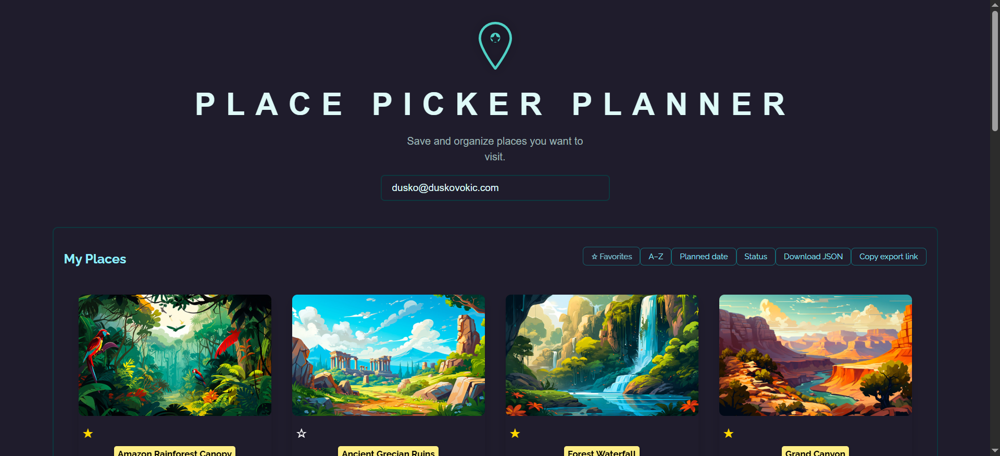
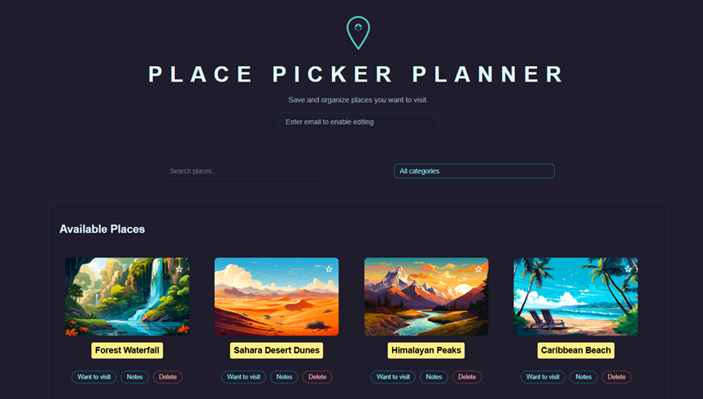
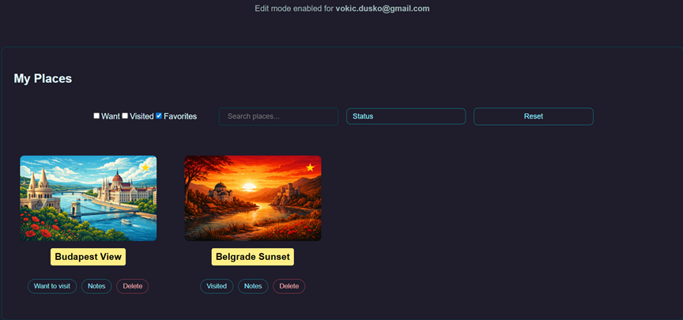
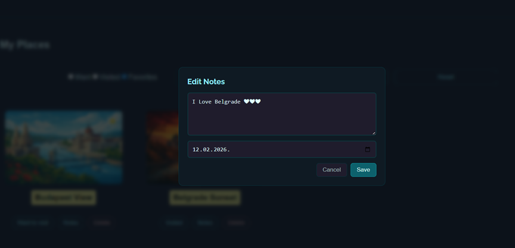
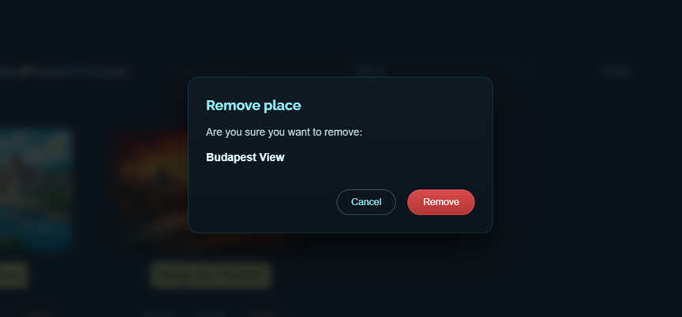

# Place Picker Planner v2.0

A full-stack place management application with persistent storage, deterministic UI behavior, and comprehensive automated test coverage.

This is version 2.0, fully verified and deployment-ready.

## Demo

Live demo: https://place-picker-planner.netlify.app/



---

## Project Status

### Stable & Verified

#### Current Phase:

- STEP GROUP 5 – Deployment

No known regressions. No blocked tasks.

---

## Features Showcase

Visual walkthrough of the core features and verified user flows in Place Picker Planner v2.0.

All screenshots are stored in:

/public/screenshots/

### Application Start & Edit Mode

Initial application state with clean layout and deterministic rendering.
Edit Mode enables full place management functionality.

**Screenshot file:**



### Add Places: Available → My Places

Places can be added from Available Places into My Places.
Duplicate additions are prevented on both frontend and backend.

**Screenshot file:**


### Favorites & Status Toggle

Each place supports:

- Favorite toggle
- Status toggle: Want to Visit / Visited

Changes persist across reloads.

**Screenshot file:**



### Notes Editor Modal

Each place includes a Notes modal for adding or editing personal notes.
Notes are persisted using the backend SQLite database.

**Screenshot file:**



### Safe Deletion with Confirmation

Places can be removed only after explicit confirmation, preventing accidental deletion.

**Screenshot file:**



---

## Key Features

### Frontend

- Add places from Available Places to My Places
- Toggle Visited / Want to Visit status
- Mark places as Favorites
- Notes editor modal with persistence
- Category filtering
- Multiple sorting modes
- Search input
- Deterministic rendering (no duplicate keys)
- Fully responsive UI
- Accessible modal and form interactions

### Backend

- SQLite persistence (app.db)
- REST API with stable endpoints
- Duplicate-safe add logic (backend no-op on duplicates)
- JSON data bootstrap support

---

## Test Coverage

### Unit & Integration Tests (Vitest)

#### Locations:

- src/utils/api.test.js
- src/utils/placeTransform.test.js
- src/views/placesReducer.test.js
- backend/app.integration.test.js

#### Status

- All tests passing
- Isolated from E2E tests
- No overlap with node_modules

Run:

```bash
npm run test
```

---

## End-to-End Tests (Playwright)

#### Location:

- src/tests/e2e/critical-paths.spec.js

#### Covered flows:

- App load & edit mode enable
- Add place to My Places
- Toggle favorite and status
- Delete place with confirmation

#### Status:

- All tests passing
- Duplicate-safe
- Backend-dependent behavior verified

Run:

```bash
npx playwright test
```

---

## Project Structure (Simplified)

```Place Picker v2-deployment
├── backend
│   ├── data
│   │   ├── app.db
│   │   ├── places.json
│   │   └── user-places.json
│   ├── app.js
│   └── app.integration.test.js
├── src
│   ├── components
│   ├── views
│   ├── utils
│   ├── tests/e2e
│   ├── App.jsx
│   └── main.jsx
├── public
│   └── screenshots
│       ├── 01-app-start-edit-mode.png
│       ├── 02-add-place-to-my-places.png
│       ├── 03-favorite-and-status-toggle.png
│       ├── 04-notes-modal.png
│       └── 05-delete-confirmation-modal.png
├── playwright.config.js
├── vite.config.js
├── README.md
└── package.json
```

## Environment Configuration

Two environments are supported:

- .env.development
- .env.production

Backend uses SQLite and does not require external services.

---

## Running the App

To run the application locally, follow the steps below.

### 1. Install frontend dependencies

From the project root directory, install the required dependencies:

```bash
npm install
```

### 2. Start frontend

After the installation is complete, start the Vite development server:

```bash
npm run dev
```

### 3. Install backend dependencies

Open a new terminal window, navigate to the backend folder, and install backend dependencies:

```bash
cd backend
npm install
```

### 4. Start backend

From the backend folder, start the Node.js server:

```bash
node app.js
```

The frontend and backend servers must be running simultaneously for the application to work correctly.

---

## Verified Guarantees

- No duplicate place creation (frontend & backend)
- Filter → sort pipeline integrity preserved
- Edit mode authentication stable
- Header and auth flow consistent
- Notes, favorites, and status fully persistent
- Tests do not mutate application logic

---

### Deployment Readiness

All mandatory pre-deployment requirements are fulfilled:

- Test verification completed
- No logic changes during test adaptation
- Stable UI / UX
- Deterministic rendering
- Backend persistence verified

The project is safe to deploy.

---

## Contributing / Support

- Contributions are welcome. Feel free to open an issue or submit a pull request.
- For problems or suggestions, please use GitHub issues.

---

## Author

This project is maintained by \*\*Dusko Vokic\*\*
You can reach out via:

- GitHub: https://github.com/D-vokic
- Website: https://duskovokic.com

---

## This project is licensed under the MIT License - see the [LICENSE.md](LICENSE.md) file for details
